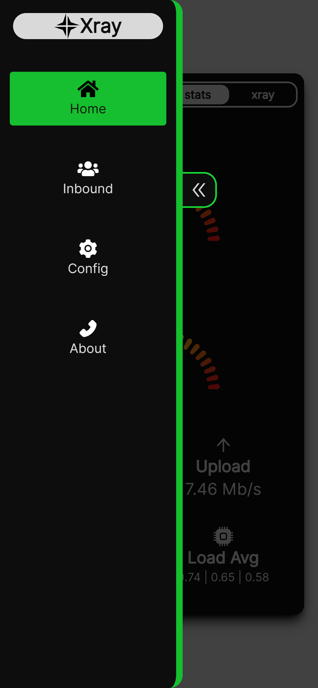

# xray-manager
A pretty simple but futuristic management panel written in ReactJS & Golang for xray-core

# 🚧 Under construction 🚧
For now I'm working on the front-end. To preview it you may run the following commands: (You'll need nodejs version 18 or later)

1. `git clone https://github.com/lilendian0x00/xray-manager.git`

2. `cd xray-manager`

3. `npm i` # Install dependencies

4. `mv .env.example .env` # secret environment variables

5. `npm start` # to start the webserver

# Full size screenshot (iPhone 12 Pro)

